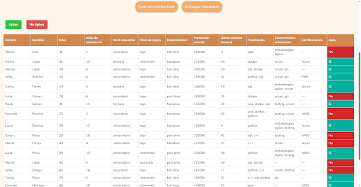

# Aptin - Evaluación de candidatos

Aptin es una aplicación que permite evaluar la aptitud de candidatos para el puesto que se esté buscando empleados.
Mediante un entrenamiento previo con datos de candidatos ya evaluados, el modelo de machine learning de Scikit-Learn analiza la aptitud de nuevos candidatos para el puesto de trabajo.

## Requerimientos

* Python 3.12
* scikit-learn 1.5.2
* pandas
* flask
* openpyxl
* flask-cors

## Instalación

Situados en la raíz del proyecto: 

* pip install -r requirements.txt
* python3.12 src/api.py

## Uso
Una vez en la página de la aplicación, veremos la siguiente pantalla de inicio:

En esta vista, se explica cómo utilizar la aplicación y se provee un archivo excel de template en el cual podremos ingresar los datos de nuestros candidatos en base a las columnas especificadas. Una vez cargados todos los datos de los candidatos que se desee evaluar, se debe proceder a subir el archivo.

Luego del análisis, la página nos arrojará la siguiente vista:

En esta vista, la aplicación nos muestra los resultados del análisis en forma de tabla, con la columna final Apto indicándonos si el candidato de la fila es válido para el trabajo en base a los datos de entrenamiento que recibió.
La vista posee dos botones de filtrado de uso simple Aptos y No Aptos para esconder/mostrar los candidatos aptos y no aptos respectivamente. A modo de ejemplo, mostraremos la vista con el botón de no aptos desactivado: 

Como se ve en la imágen, el botón esconde los candidatos que no son considerados aptos por el modelo.
Además, se facilita la reinicialización del análisis mediante el botón Subir otro archivo Excel, con el cual podremos ingresar nuevos datos de candidatos sin analizar para que el modelo nos arroje el análisis.
Finalmente, el botón Descargar Resultados permite descargar los resultados en formato excel, facilitando de esta manera la exportación de los resultados, el cual se ve de esta manera:

